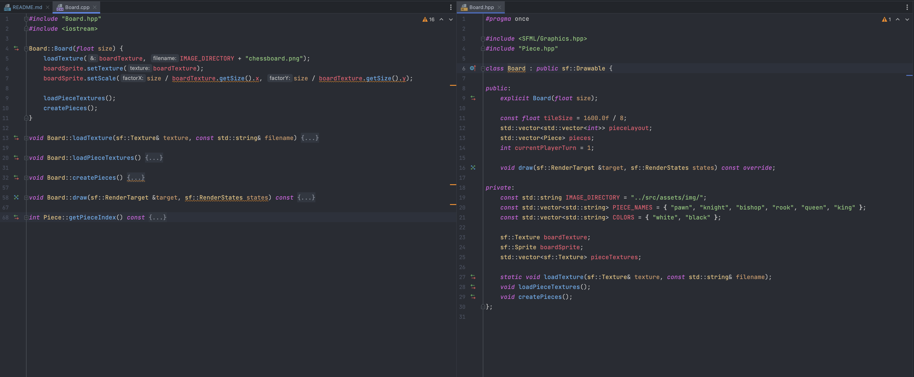

# Chess, an ADA Project

## Section 1, Challenge Outline.

### 1a. Problem Summary

  The project created here will be a basic chess implementation, the program will incorporate as many rules of classical
chess as possible, with priority sitting on creating a program using various coding best practices. The goal for submission
will be to have a functioning program, with a menu that the user can select between PvP (player vs player) or PvC (player vs computer.)
This initial release for submission will be a "dumbed down" version of chess being turn based with limited rules and only the 
PvP version being implemented. The rest of the chess rules will be implemented on a later release as well as PvC, 
but we will speak on how these will be achieved later in this document. 

### 1b. UML Diagram of the current project state and Project Structure

#### UML Diagram:

***NOTE:*** *If you would like a closer look at this img please find it at "src/assets/img/ChessProjectUML.png"*

#### Project Structure:

- 📂 Project Root
    - 📄 CMakeLists.txt
    - 📄 README.txt
    - 📄 .gitignore
    - 📂 include
        - 📄 Board.hpp
        - 📄 BoardEvent.hpp
        - 📄 Menu.hpp
        - 📄 Piece.hpp
        - 📄 PieceMovement.hpp
    - 📂 src
        - 📂 assets
            - 📂 img
                - 🖼️ (all image files stored here as .png)
        - 📂 main
            - 📂 menu
                - 📄 Menu.cpp
            - 📂 game
                - 📄 Board.cpp
                - 📄 BoardEvent.cpp
                - 📄 Piece.cpp
                - 📄 PieceMovement.cpp
            - 📄 main.cpp

### 1c. Initial Plan and design approach

  My overall design approach was to follow the MVC (model/view/controller) architectural pattern, so my main game loop
will handle the logic of which objects to draw when, taking on the View component. The model component then houses 
Board and Menu, which are drawable objects structured on initialisation by their respective constructors 
(Piece also comes under this, but this is a component of Board.) And finally any other classes are housed within the
Controller component, and these classes will modify attributes within the Model component to reflect the current game state.

My plan was to initially create the main game loop, and then to branch out from there, initialising the Board on start up 
was the first task, rendering this with its piece on screen. Then adding various controller components from there to implement the chess rules.
I used Jira to track these changes and keep tasks modular, which is shown in section 1d. 

I would often revisit these changes, straying from my Jira tasks to refactor code, this although not best working practice 
helped me to keep on top of the code becoming too complicated and also consider coding best practices at this point, 
I will speak on some of these refactors later.

### 1d. A breakdown of tasks

  Using Jira software I broke the tasks down into sizable chunks, not necessarily in the form of epics but in the form of single tasks, trying not to make them too large. 
For example, "CHS-6 Create method to find possible moves for each piece type" was probably one of the larger changes taking me around 3 - 4 days 
to complete this, a fair amount of time for a single task. As you can see in the img below there are tickets in place for the remaining tasks, 
currently with a status of "TO DO." The tickets with a status of "DONE" where what I considered to be enough to create an MVP fulfilling the module brief.


***NOTE:*** *If you would like a closer look at this img please find it at "src/assets/img/JiraIssues.png"*

### 1e. Object Oriented design ideas

  The object-oriented design of this program utilises the principle of single-responsibility. The tasks are broken down into 
manageable portions that carry out a single task, and this is also reflected in my Jira tickets, only working on a singular task at a time.
This gives my program great modularity, referred to as Encapsulation. Classes have a single job, and that job can be inferred by the Class name,
like PieceMovement, BoardEvent, Piece, Board, Menu etc. 

Existing data structures have been used appropriately and I have created custom data types where necessary, for example the use of sf::Texture and sf::Sprite 
for handling graphics, std::unordered_map to associate specific SFML event types with the corresponding function handlers, and a std::vector of sf::Texture 
and Piece to store all textures and game pieces. It is good practice to choose the data type that best suits your needs, 
considering factors such as the operations you need to perform, although there are gaps in my choices. For example pieces a represented in the
layout using integers for their respective types and stored in std::vector<std::vector<int>> pieceLayout. This would have been better suited as
std::vector<std::vector<PieceName>> pieceLayout where PieceName is an enumerated type, similar to that of Menu::Option, which is used to as a flag 
for the user's choice within the menu. This would have enhanced readability throughout my code as this pieceIndex value is used in a large number of cases. 

On error handling, I have correctly checked if all texture files are loaded successfully. It's a good practice to do error handling especially for I/O operations which 
are prone to errors. Although the use of std::exit() here is not ideal, calling std::exit() to terminate the program in case of error isn't usually the best practice. 
It would be better to throw a custom exception and catch it at a higher level where you can exit more gracefully. This might involve releasing resources,
saving state, or informing the user about what happened.

## Section 2, Development.

### 2a. Adoption of best practices

  I mentioned in previous sections some the refactors I'd done to adhere to best practices, this could include a refactor I did of the PieceMovement
class. Originally this class had individual methods for each pieceType and consisted of 270 lines of code, after realising that 3 piece types move in
a similar fashion I was able to refactor this to make use of repeated code, thus making the file some 150 lines and much easier to read. 

I also refactored the main game loop, and now we have all event types stored within unordered maps, the motivation for making this change was that 
there could potentially be more events to add to this game, meaning that the main game loop had potential to grow beyond a desirable size. By 
storing the events within an unordered map towards the top of the file we can add new events and method calls to the maps, within ever needing 
to change the main game loop, enhancing both maintainability and readability.

### 2b. Reviewing Code Changes

  After each change I would often go back over the code and review certain things. A good practice I have learnt from colleagues is to ask the
following questions; Can complexity be broken down? Are variables required or can be inlined? Is the code readable for other developers? And, 
is each line of code required or can be simplified? I'd base a lot of refactors on this, and in cases of large scale refactoring I created a Jira 
ticket to do this. CHS-10 and CHS-11 are two examples of tickets I created off the back of code reviews. 

### 2c. A code refactor example

After changes CHS-8 and prior changes, my Board.cpp was looking very clustered and had many examples of bad coding practice throughout. 
See the original [here](https://github.com/crxig-rxberts/Chess/blob/b9118a0b2a8216f9f4423f2c801c87bbb2e23a61/src/Board.cpp). Not only did I encapsulate 
all the code into its own helper class, BoardEvent.cpp, I also refactored the code to be much more readable and modular, something that I will 
into more detail on in section 3, but the latest BoardEvent.cpp can be seen [here](https://github.com/crxig-rxberts/Chess/blob/main/src/BoardEvent.cpp).

### 2d. Assuring quality

To ensure that my methods were working correctly I would use two methods, one would be debugging statements and another would be through CLion's 
debugging tool. Firstly, take for example the PieceMovement class, these methods would perform calculations on a nested vector of type integer (pieceLayout),
so I had function to hand which would print the pieceLayout vector in a form that resembled the chess board, this would allow me to do manual testing
on my methods as I developed them, seeing as I had no automated tests in place. 

CLion's debugging tool is especially helpful and something I use through IntelliJ frequently. This allows you to put breaks in the code execution and run in debug mode, 
this way you can perform evaluations on the code as it is running, say I wanted to see if a certain value is being calculated correctly you can put a code break 
within the calculation, run the app and then the program will stop here, and you can perform that expression to see the returned result. 
This proved useful during an ongoing task's implementation of a check helper, which allows me to see certain boolean values that get passed between methods but aren't visible during run time. 

## Section 3, Analysis.

### 3a. i. Code refactoring analysis

Here I would like to discuss two refactors that I have previously mentioned in more depth, firstly BoardEvent.cpp which can be seen again
[here](https://github.com/crxig-rxberts/Chess/blob/main/src/BoardEvent.cpp). I'm particularly happy with the modularity of this file, original code
which can be seen [here](https://github.com/crxig-rxberts/Chess/blob/b9118a0b2a8216f9f4423f2c801c87bbb2e23a61/src/Board.cpp) had a great deal of complexity
with methods that were not easily maintained. My refactor of this file mainly focussed on making methods very specific carrying out a single task, for example
in the refactored file on line 56 we see a method releasePiece, which was a large complex method, now made far more readable by the breakdown of individual tasks;
isPossibleMove(), handleLegalMove(), revertMove() and resetDragState(). If I were to do work on this method in the future, for example when I implement checking logic 
it will be fair easier to insert this logic where necessary and alter individual methods here where necessary. 

Another refactor I'd like to speak about is PieceMovement, this focussed on amending bad practice around the DRY principle. The file contained unnecessary weight in 
the form of repeated code. This was due to the fact that the calculations performed for a bishop, a rook, and a queen could all be done in the same 
by just giving the method the relevant directional movements that a piece could make. The original code can be seen here and the refactored code can be seen
[here](https://github.com/crxig-rxberts/Chess/blob/b9118a0b2a8216f9f4423f2c801c87bbb2e23a61/src/Board.cpp), notice on line 97 calculateDirectionalPieceMoves has replaced 
three methods specific to rook, bishop and queen. 

### 3a. ii. Code Smells

Along the way of creating this project I have encountered various code smells, one glaring one would be the Board class and mixing public and private
members, generally considered bad coding practice. But there a few code smells throughout my project that I will discuss. To help me highlight code smells
I have used a tool called SonarLint, which is popular within the industry for improving the quality of your code. 

With a program like my chess game, there is a lot of potential for narrowing and implicit conversions, narrowing conversion is when we take a larger value, like a float
and convert it to type integer and vice versa for implicit conversions. This is generally bad practice and although not the case in my program can cause
data loss. I have remedied this code smell in various places, but we still see it in parts of the code, one example is that of the line 
``` auto col = static_cast<int>((x + mouseOffset.x) / board.tileSize);```. Here I have cast the float to an int before performing the operation thus removing
the conversion smell. 

Sonar lint also helped me refactor another code smell. I have a method is possible move, which you can see the before and after of the refactored method.
There are a couple of reasons why this would be marked as a code smell, firstly Using STL algorithms like std::any_of helps to express the intention of the code 
more clearly than using raw loops. When a future developer reads std::any_of, they know immediately that the code is checking if any element in the range satisfies 
the condition. This makes the code easier to understand and maintain. But also std::any_of stops iterating as soon as it finds an element that satisfies the predicate, 
whereas the loop will continue to iterate over the rest of the elements even after it has found a match. Thus making the refactored method use less compute power, increasing
efficiency.

**Before:**
```
  bool BoardEvent::isPossibleMove(int col, int row) {
    sf::Vector2i newTile(col, row);
    for (const auto &move: possibleMoves) {
        if (move == newTile) {
            return true;
        }
    }
    return false;
} 
```
**After:**
```
  bool BoardEvent::isPossibleMove(int col, int row) {
    sf::Vector2i newTile(col, row);
    return std::any_of(possibleMoves.begin(), possibleMoves.end(), 
                            [newTile](const auto& move){ return move == newTile; });
}
```

### 3b. OOP Principles

#### Encapsulation

I have chosen the below image as an example of encapsulation due to this also slightly breaking the principle, thus giving me an opportunity to discuss how to improve this class.
The below image is of my Board.cpp and Board.hpp, this is a class which contains a constructor in which all the Board attributes are self
instantiated. I then have helper classes like BoardEvent which will handle any altercations to the attributes within this class. The way in which this class
is flawed though can be seen if we look at Board.hpp on the right hand side of the image. Attributes like pieceLayout, pieces and currentPlayerTurn are public
members, which in the case of encapsulation these should all be privatised. If I wanted our helper classes to make altercations to these attributes I should be
providing public getter and setter methods here so that, say for pieceLayout, for this to be altered, a helper class would retrieve pieceLayout via board.getPieceLayout()
then perform actions on a copy of this and then set the copy using board.setPieceLayout(alteredCopy); With this refactor, that I will make in the future this class
will be truly following the encapsulation principle.




#### Abstraction

There are various examples of Abstraction within my code, the Menu and Board classes abstract their self instantiation within their constructor, but I'll speak
on a different area for this example. Within the BoardEvent.cpp class at line 48, see [here](https://github.com/crxig-rxberts/Chess/blob/e8740d353437257dc00ef127851811d1b92c857f/src/main/game/BoardEvent.cpp#L48),
we have the method findLegalMoves() and within this we perform ```possibleMoves = PieceMovement::calculateMovesForPiece(piece, board);```. By creating a separate
class PieceMovement, I am able to abstract away the algorithm that populates this possibleMoves vector, thus taking the concern away from the BoardEvent class
that was not designed to handle such problems. BoardEvent can handle all the altercations to the Board object and then PieceMovement can handle the algorithms for
the piece movement rules. Following this principle makes the program much easier to expand and maintain, whilst also keeping it clear what each classes purpose is. 
This is a great example of abstraction, due to this one line of code being able to abstract away a 150~ line algorithm. 


#### Loose Coupling 

While not strictly an OOP principle, loose coupling is a design goal often achieved through good OOP design. In my project, Board, Menu, and the main loop have been designed 
to operate independently as much as possible. The event handling mechanism allows for this separation of concerns. The main loop doesn't care whether it's the Board or Menu 
that handles the event, it just throws the event into the appropriate handler and moves on. The Menu and Board classes also don't need to know about each other; they only 
care about the events they're responsible for.

So the code is using event-driven programming principles to achieve loose coupling, where each class can be modified and tested independently as much as possible.


### 3c. Features and Innovative design

The project is structured in such a way that maintainability and expansion would be easily done. For instance when I come to implement checking moves
this will be done in the form of a new class CheckHelper or something similar, so that when It comes to implementing not allowing self checking moves, 
after the class has been implemented, this will be a single line in BoardEvent to not allow a player to make checking moves. Similar to that I used in
previous example ```possibleMoves = PieceMovement::calculateMovesForPiece(piece, board);```. We can add a simple condition something along the lines of 
isMoveSelfChecking() and if this return true, we follow the revert move path, or the carry-out move path, the current implementation of which can be seen
[here](https://github.com/crxig-rxberts/Chess/blob/e8740d353437257dc00ef127851811d1b92c857f/src/main/game/BoardEvent.cpp#L59).

Another great implementation is within the main game loop [here](https://github.com/crxig-rxberts/Chess/blob/e8740d353437257dc00ef127851811d1b92c857f/src/main/main.cpp#L29), 
this logic takes the handle of events out of the main game loop and into the unordered maps at the top of the file, this allows for a cleaner game loop
and the ability to manage and add new events with relative ease when it comes to changes within main.cpp. There are however a couple of flaws with this 
file that I will mention in the reflective review section. 

I also think the project file structure as a whole is well done, the structure can be seen in section 1b. The project is split in a typical way seen in c++
projects, with all the headers stored in an include directory and then having well split file structure for the main game files, this will be further improved
as I expand the project, for example I will be adding more helper classes, so I will undoubtedly split the model and controller sections like so: 
- 📂 main
  - 📂 menu
    - 📄 Menu.cpp
  - 📂 game
    - 📂 controllers    
      - 📄 BoardEvent.cpp
      - 📄 PieceMovement.cpp
    - 📂 model
      - 📄 Board.cpp
      - 📄 Piece.cpp

Having a clean file structure is important for maintainability of the code and for other developers to navigate easily through the project. 


3. Evaluation (academic standard: distinction level detail: section required for distinction) – 10%
   a. Analysis with embedded examples of key code refactoring, reuse, smells.
   b. Implementation and effective use of ‘advanced’ programming principles(with examples).
   c. Features showcase and embedded innovations(with examples) - opportunity to ‘highlight’ best bits.
   d. Improved algorithms – research, design, implementation, and tested confirmation (with examples).
   e. Reflective review, opportunities to improve and continued professional development.


DETAILED LOOK AT THE PROJECT


each individual file 


CRITICISM 

code smells 

bad practices 

revisions 


